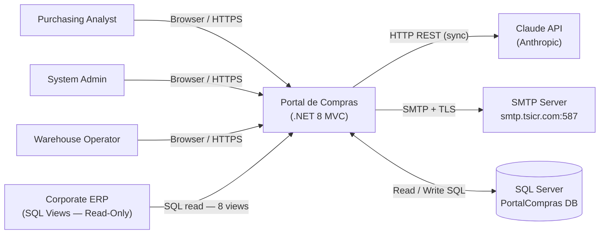
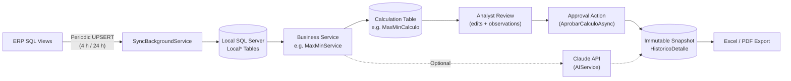
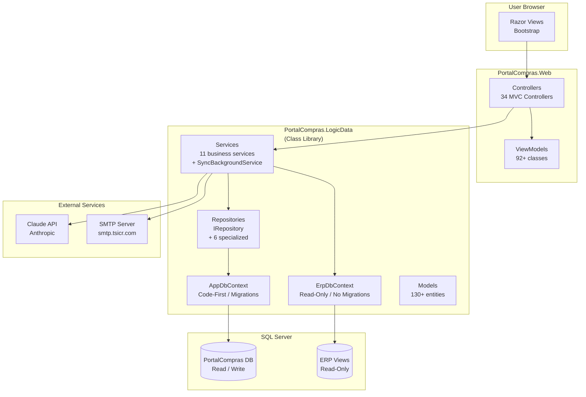
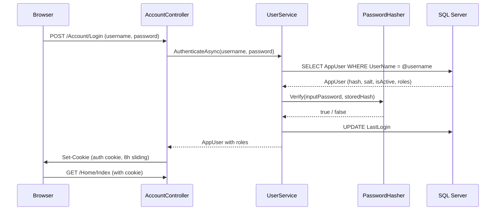
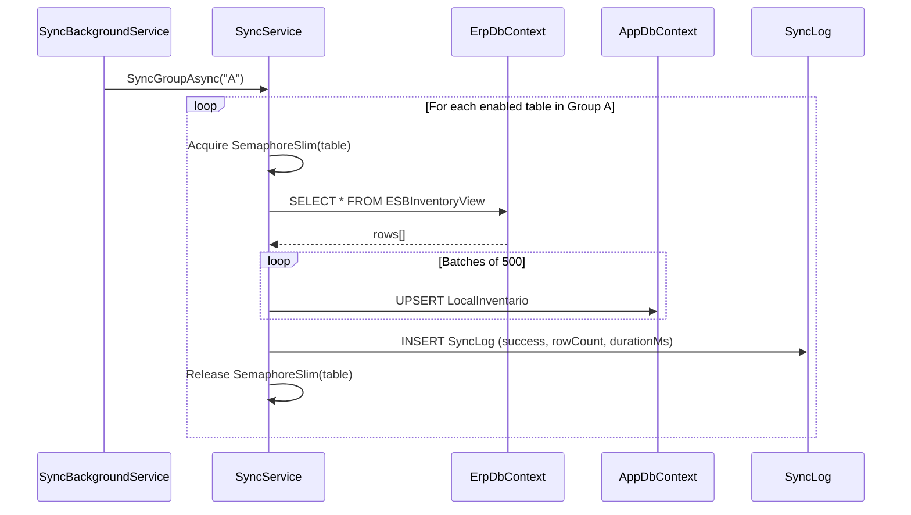
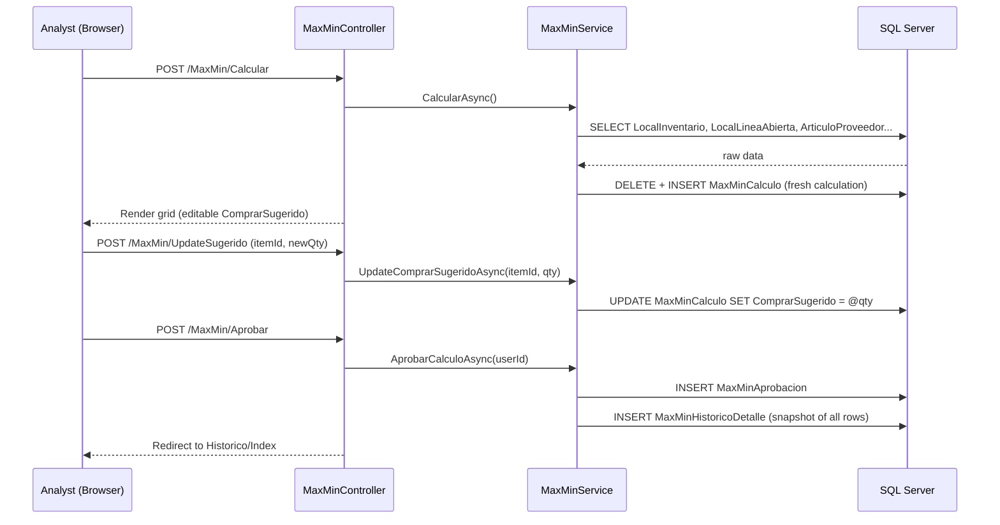
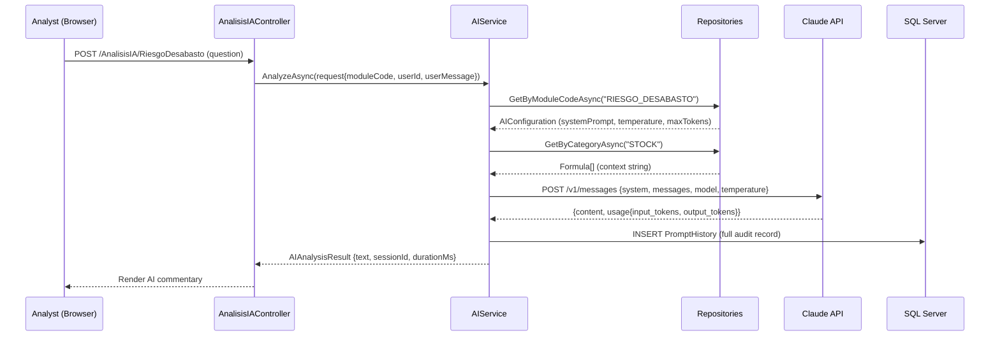
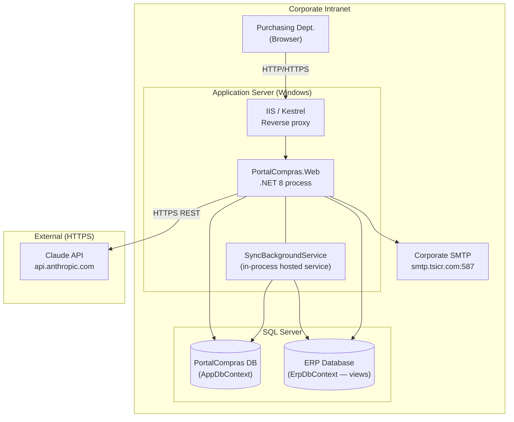
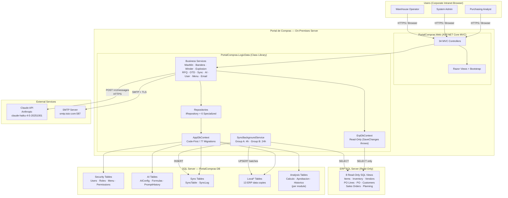

# Software Architecture Document — arc42

**Format:** arc42  
**Project:** Portal de Compras (Purchasing Portal)  
**Document version:** 1.0  
**Status:** DRAFT  
**Date:** 2026-09-01  
**Responsible:** Roberto Cervantes / Purchasing Department IT  
**System type:** On-premises intranet web application for procurement intelligence

---

# 0. Executive Summary — EXTENSION

The **Purchasing Portal (Portal de Compras)** is an on-premises intranet web application built for the company's Purchasing Department. Its purpose is to replace manual, spreadsheet-driven procurement analysis with a centralized, audited, and AI-assisted intelligence platform.

**Problem solved:** The purchasing team operated by exporting data from the corporate ERP to spreadsheets, then manually calculating reorder points, cost trends, strategic material priorities, and open order tracking. This workflow was slow, error-prone, not reproducible, and produced no formal audit trail for decisions.

**Solution:** A .NET 8 / ASP.NET Core MVC application that periodically synchronizes read-only data from the ERP (via SQL views), executes standardized multi-step calculation workflows (Max/Min reorder analysis, BOM explosion / shortage risk — "Bandera", Winder consumable management, Tool Explosion), provides AI-assisted analysis through the Claude API (Anthropic), and enforces a formal **Calculate → Review → Approve → Snapshot** cycle for every purchasing decision.

**Dominant architectural approach:** Two-layer solution (presentation + data/logic) following a layered MVC pattern with Repository and Service abstractions. The ERP is a strictly read-only external system; all analytical work runs against a local SQL Server database that is kept current through a scheduled background synchronization service.

**Principal components:** Synchronization Engine (ERP → Local DB), Analysis Engine (14 calculation modules), AI Integration (Claude API), Security (custom RBAC with cookie authentication), Administrative Console (users, roles, menus, formulas, AI config), and Reporting (Excel/PDF export).

**Most important architectural decisions:**
1. ERP is write-protected at code level — no accidental data corruption is possible.
2. Local data copy (sync) instead of real-time ERP queries — decouples portal performance from ERP load.
3. Custom PBKDF2 authentication instead of ASP.NET Identity — minimal footprint for a departmental portal.
4. Calculate → Approve → History pattern — separates tentative analysis from formal, auditable commitments.
5. AI configuration (system prompt, temperature, token limits) stored per module in the database — allows runtime tuning without code changes.
6. Calculation formulas stored in the database — guarantees reproducibility and audit of AI-assisted decisions.

**Main quality attributes:** Security, Traceability/Auditability, Maintainability, and Data Availability (tolerates ERP outages between sync windows).

**Planned evolution:** Addition of further analysis modules, potential reintroduction of a local AI model (Gemma 2 / Ollama), and formalization of a CI/CD pipeline.

**Architecture in one sentence:**

> A layered, on-premises MVC application acting as a procurement intelligence hub: it synchronizes ERP data into a local SQL Server database, executes approval-gated calculation workflows, and augments human purchasing decisions with AI-generated analysis.

**Simplified main flow:**

```text
[Purchasing Analyst — Browser]
          ↓
[ASP.NET Core MVC Controllers]
          ↓
[Business Services — Max/Min, Bandera, Winder, etc.]
          ↓
[Local SQL Server — synchronized from ERP every 4–24 h]
          ↓
[Claude API — optional AI-assisted commentary]
          ↓
[Approved Decision + Immutable Historical Snapshot]
```

---

# 1. Introduction and Goals

## 1.1 System Objective

The Purchasing Portal eliminates manual, spreadsheet-based procurement analysis for the Purchasing Department by providing a centralized web platform that:

- consumes ERP data automatically and keeps a local, queryable copy;
- executes standardized purchasing calculations (reorder points, BOM shortage risk, consumable coverage, tool explosion) with full parameter traceability;
- enforces a formal review-and-approval workflow before any purchasing recommendation becomes a recorded decision;
- augments analyst judgment with AI-generated commentary on complex scenarios;
- records every decision, calculation parameter, and AI interaction for compliance and reproducibility.

The system does **not** write to the ERP. It is a decision-support platform, not a transaction system.

## 1.2 Quality Goals

| Priority | Attribute | Objective / Rationale |
|---|---|---|
| 1 | **Security** | Prevent unauthorized access to procurement data and protect the ERP from accidental writes. Purchasing data (prices, vendors, quantities) is commercially sensitive. |
| 2 | **Traceability / Auditability** | Every calculation, approval, and AI interaction must be reconstructable after the fact. Purchasing decisions must be defensible with data. |
| 3 | **Maintainability** | A small team (potentially a single developer) must be able to add new analysis modules, adjust formulas, and evolve the schema safely. Code-First migrations enforce versioned, repeatable schema changes. |
| 4 | **Data Availability** | Users must be able to work even if the ERP is momentarily unreachable. The local data copy ensures this within the sync interval. |
| 5 | **Performance** | Calculation results and list pages must respond within acceptable latency for a departmental intranet (target: P95 < 3 s for standard views). Large datasets are paginated and synced in batches. |
| 6 | **Usability** | The portal must be operable by purchasing analysts without specialized technical training. Server-side rendered Razor pages with Bootstrap minimize client-side complexity. |

## 1.3 Stakeholders

| Stakeholder | Interest / Expectation | Architectural Impact |
|---|---|---|
| **Purchasing Analyst (role: User)** | Fast access to pre-calculated reorder recommendations, open order tracking, and AI-assisted scenario analysis | Drives module design, UX pattern, calculation engine scope |
| **Purchasing Manager (role: Admin / User)** | Formal approval workflow, historical audit trail, exportable reports | Drives the Calculate → Approve → History pattern; Excel/PDF export |
| **Warehouse Operator (role: Almacén)** | Access to goods receipt checklist only | Drives granular role-based menu permission model |
| **Read-only Reviewer (role: Ver)** | View analysis results without modifying data | Drives read-only role in RBAC and `[Authorize]` guards |
| **System Administrator (role: Admin)** | User management, role assignment, AI configuration, sync monitoring | Drives Admin module: users, roles, menus, AI config, formulas |
| **ERP System / ERP Team** | ERP must never be modified by the portal | Drives the read-only constraint: `ErpDbContext`, no migrations, enforced `SaveChanges()` exception |
| **IT / Infrastructure** | On-premises deployment, SQL Server shared environment, no cloud dependencies in core path | Drives on-premises deployment model, local AI preference |
| **Compliance / Audit** | Decisions traceable to data, user, timestamp, and formula | Drives `PromptHistory`, approval snapshots, `ProduccionDiariaBitacora` |

---

# 2. Architecture Constraints

## 2.1 Technical Constraints

| Area | Constraint / Technology | Rationale | Mandatory |
|---|---|---|---|
| Framework | ASP.NET Core MVC (.NET 8 LTS) | Established .NET ecosystem in the organization; LTS support | Yes |
| Language | C# | Team skill set | Yes |
| ORM | Entity Framework Core 8 — Code-First | Versioned schema evolution via migrations | Yes |
| Database | SQL Server | Shared infrastructure with ERP; simplifies network topology | Yes |
| ERP Access | Read-only via SQL views | ERP is a mission-critical shared system — no write access allowed | Yes |
| AI Provider | Claude API (Anthropic) — `claude-haiku-4-5-20251001` | Current implementation; originally scoped as Gemma 2 / Ollama local | Yes (current) |
| IDE | Visual Studio 2022 | Development environment | Yes |
| UI framework | Bootstrap + Server-side Razor | No SPA complexity needed for a departmental intranet | Yes |
| Report generation | ClosedXML (Excel), QuestPDF (PDF) | Office-compatible output without proprietary licenses | Yes |
| Authentication | Custom cookies + PBKDF2-SHA256 | No ASP.NET Identity dependency | Yes |
| Deployment | On-premises / intranet | Data must stay within the corporate network | Yes |

## 2.2 Organizational Constraints

- Small development team (likely a single developer/maintainer).
- No formal CI/CD pipeline in place as of v1.3.1; deployment is manual via `dotnet publish` or Visual Studio 2022.
- The system is departmental — tens of concurrent users at most; it is not designed for internet-scale traffic.
- The ERP system is owned by a separate team; the Purchasing Portal team has no write access to ERP schema or data.
- Email notifications use the corporate SMTP server (`smtp.tsicr.com:587`), which is a shared service managed by IT.

## 2.3 Regulatory, Legal, and Compliance Constraints

- Purchasing data (vendor prices, quantities, strategic materials) is commercially sensitive. Access is restricted to authenticated users with explicit role-based permissions.
- Formal audit trail is required for purchasing decisions: who approved what, when, and based on which data.
- ERP integrity is a hard constraint: any accidental write to the ERP would be a serious compliance violation. This is enforced at code level, not just policy.
- Data residency: all data must remain on the corporate intranet (on-premises SQL Server). The Claude API call is the only external network dependency in the current implementation (see ADR-007 and Risk R-003).

## 2.4 Deliberately Open Constraints

- **AI provider portability:** The `IAIService` interface decouples the application from the Claude API. The original architecture targeted Gemma 2 / Ollama (local). Switching back to a local model is a valid future path. See ADR-007.
- **CI/CD pipeline:** Not yet defined. The choice of pipeline tool (GitHub Actions, Azure DevOps, etc.) is open.
- **HTTPS enforcement:** Not explicitly documented in configuration; assumed to be handled at the IIS/reverse-proxy layer. This should be confirmed and enforced. See R-004.
- **Backup and disaster recovery strategy:** Not defined in the codebase or documentation. TBD.

---

# 3. Context and Scope

## 3.1 Business Context



**Interaction descriptions:**

| Actor / External System | Input to Portal | Output from Portal | Protocol / Channel |
|---|---|---|---|
| Purchasing Analyst | Triggers calculations, enters parameters, approves decisions | Analysis results, Excel/PDF exports, AI commentary | Browser / HTTP |
| System Admin | Manages users, roles, menus, AI configs, formulas | Configuration changes, sync status dashboard | Browser / HTTP |
| Warehouse Operator | Performs goods receipt checklist | Checklist completion records | Browser / HTTP |
| Corporate ERP | Inventory levels, open POs, items, vendors, customers, planning, sales orders | None (strictly read-only) | SQL Server network query |
| Claude API (Anthropic) | — | AI-generated analytical commentary on purchasing scenarios | HTTPS REST — Anthropic v1/messages |
| SMTP Server | — | Email notifications and analysis report attachments | SMTP + TLS / port 587 |

## 3.2 Technical Context

- **ERP integration:** The portal connects to the same SQL Server infrastructure as the ERP (or a network-accessible replica). It queries 8 predefined read-only views: `ESBItemMasterHeaderView`, `itemwhse_all`, `ESBVendorView`, `ESBPurchaseOrderLineView`, `ESBPurchaseOrderView`, `ESBCustomerView`, `CorCOpenOrders`, `PlanningDetailsView`. The connection string for the ERP is provided via `appsettings.json` (`ErpConnection`).
- **Local database:** A dedicated `PortalCompras` SQL Server database (separate schema from the ERP) stores all local data, analysis state, user accounts, audit logs, and configuration. EF Core Code-First manages its schema via migrations.
- **AI service:** HTTP calls to `https://api.anthropic.com/v1/messages` using a named `HttpClient` (`"Claude"`) configured with a 60-second timeout. The API key is stored in `appsettings.json` / User Secrets.
- **Email:** SMTP with TLS on `smtp.tsicr.com:587`, credentials in configuration.
- **Background synchronization:** A .NET hosted service (`SyncBackgroundService`) runs inside the same process as the web application, executing ERP synchronization on configurable intervals.

## 3.3 Scope

**Included:**

- ERP data synchronization (periodic, background, automatic) — read-only from ERP.
- Procurement analysis workflows: Max/Min reorder points, Bandera BOM shortage risk, Winder consumable coverage, Tool Explosion, High-Runner management.
- AI-assisted analysis for complex purchasing scenarios (6 configured modules + expandable).
- Formal approval workflow with immutable historical snapshots for all calculation modules.
- Master data management: vendor-item catalog, payment terms, delivery addresses, item substitutions, exclusions, vendor parameters.
- Order tracking: open purchase order lines, solicitation follow-up, OTD exception management.
- Operational records: daily production log, weekly operations plan, daily tool consumption.
- RFQ (Request for Quotation) workflow.
- Goods receipt quality checklist.
- Reporting: Excel and PDF export from all major modules.
- User management, role-based access control, and dynamic menu permissions.
- Synchronization monitoring dashboard.

**Out of scope:**

- Writing any data back to the corporate ERP.
- ERP transaction processing (purchase order creation, goods receipts in ERP, invoice management).
- Financial accounting or accounts payable.
- Customer-facing portal or internet access.
- Native mobile application.
- Integration with external vendor portals.

**Planned for future evolution:**

- Reintroduction of a local AI model (Gemma 2 / Ollama) to eliminate external API dependency.
- CI/CD pipeline formalization.
- Additional analysis modules as the department's needs grow.
- Potential multi-company or multi-site support.

---

# 4. Solution Strategy

## 4.1 Architectural Style

The solution uses:

- **Layered architecture (two-project)** — `PortalCompras.Web` (presentation) and `PortalCompras.LogicData` (data + business logic). Clear dependency direction: Web → LogicData, never the reverse.
- **MVC (Model-View-Controller)** — standard ASP.NET Core MVC with server-side Razor rendering. No SPA framework; appropriate for an intranet portal used by a small number of analysts who value data density over animation.
- **Repository + Service pattern** — Controllers delegate to Services; Services use Repositories for data access. This isolates business logic from EF Core and keeps controllers thin.
- **CQRS-lite / dual context** — `ErpDbContext` (read-only, no migrations) and `AppDbContext` (read-write, owns all migrations) provide a clear physical separation between the ERP read path and the portal write path.
- **Background hosted service** — `SyncBackgroundService` runs inside the same process as the web app, executing scheduled ERP synchronization without requiring a separate process or job scheduler.

## 4.2 Architectural Principles

- **ERP is sacred:** No portal operation may write to ERP data. This is enforced in code, not just policy.
- **Reproducibility before convenience:** Calculation formulas and AI configurations are stored in the database, not hardcoded, so that past decisions can always be reconstructed exactly.
- **Approve before committing:** No analysis result enters the permanent historical record without explicit human approval. Tentative calculations are mutable; approved snapshots are immutable.
- **Audit everything that matters:** AI calls, approval events, and sensitive data mutations are logged with user, timestamp, and full context.
- **Local data first:** All analytical queries run against local SQL Server tables (copies of ERP data), never against the ERP in real time. This protects ERP performance and enables the portal to function during ERP maintenance windows.
- **Separation of concerns (SOLID):** Business logic lives in Services, not Controllers; domain state lives in Models, not ViewModels.

## 4.3 Main Flow/Pipeline



## 4.4 Key Strategic Decisions

| Decision | Rationale | Main Consequence | ADR |
|---|---|---|---|
| ERP is strictly read-only | Prevent accidental corruption of the mission-critical ERP | Portal can never update ERP data; sync is always one-directional | ADR-001 |
| Local sync copy instead of real-time ERP queries | Decouple portal analytics from ERP load; enable offline operation | Data is never more current than the last sync cycle (4–24 h lag) | ADR-002 |
| Custom auth (PBKDF2) instead of ASP.NET Identity | Minimal dependency footprint for a small departmental portal | Full control over the security model; no Identity scaffolding overhead | ADR-003 |
| Calculate → Review → Approve → History pattern | Enforce human oversight before decisions are recorded permanently | Two database tables per module (mutable calc + immutable history); more schema complexity | ADR-004 |
| AI configuration per module stored in DB | Allow runtime adjustment of prompts without code deployments | Requires admin UI; configuration drift risk if not governed | ADR-005 |
| Formulas stored in database | Guarantee audit reproducibility; decouple formula logic from code | Slightly more complex than hardcoded formulas; enables non-developer formula tuning | ADR-006 |
| Switch from Gemma 2 / Ollama to Claude API | Claude API provides higher quality analysis; eliminates local GPU requirement | External API dependency; data leaves the corporate network; recurring cost | ADR-007 |

---

# 5. Building Blocks

## 5.1 Level 1 — Main Containers



| Block | Responsibility | Technology | Main Interfaces |
|---|---|---|---|
| **PortalCompras.Web** | HTTP request handling, view rendering, authentication cookies | ASP.NET Core MVC 8, Razor, Bootstrap | Browser HTTP; delegates to LogicData services |
| **PortalCompras.LogicData** | Business logic, data access, ERP sync, AI integration | C# class library, EF Core 8, HttpClient | Used by Web layer; calls SQL Server and external APIs |
| **AppDbContext** | Manages all portal-owned data (users, analysis, config, sync logs) | EF Core 8, SQL Server, Code-First migrations | 60+ DbSets; 77 migrations as of v1.3.1 |
| **ErpDbContext** | Read-only access to ERP SQL views | EF Core 8, SQL Server; `SaveChanges()` throws by design | 8 DbSets (ERP views only) |
| **SyncBackgroundService** | Periodically copies ERP view data to local tables | .NET IHostedService, System.Threading.Timer | Calls SyncService; runs inside web process |
| **Claude API** | AI-generated commentary for purchasing scenario analysis | HTTPS REST — Anthropic API v1/messages | Called by AIService; responses stored in PromptHistory |
| **SQL Server — PortalCompras DB** | Persistent store for all portal data | SQL Server (on-premises) | Accessed exclusively via EF Core |
| **SMTP Server** | Outbound email notifications | SMTP + TLS | Called by EmailService |

## 5.2 PortalCompras.Web

**Purpose:** HTTP presentation layer. Handles authentication, request routing, model binding, and HTML rendering.

**Responsibilities:**

- Authenticate users via cookie middleware; redirect unauthenticated requests to `/Account/Login`.
- Route requests to 34 MVC Controllers, each scoped to a business domain.
- Translate service results into ViewModels for Razor template rendering.
- Produce Excel exports (ClosedXML) and PDF documents (QuestPDF) in response to export actions.
- Serve static assets (Bootstrap, icons, custom JS/CSS) from `wwwroot/`.

**Not the responsibility of this block:**

- Business logic (delegated to Services in LogicData).
- Direct database access (all data access goes through Services and Repositories).

**Controller groups by domain:**

| Domain | Controllers |
|---|---|
| Identity | `AccountController` |
| Administration | `AdminController`, `MasterDataController` |
| ERP Sync monitoring | `SyncController` |
| Analysis modules | `MaxMinController`, `BanderaController`, `ExplosionHerramientaController`, `WinderMaterialController`, `AnalisisWinderController`, `HerramientaHighRunnerController`, `AnalisisPreciosController`, `CostosController` |
| AI-assisted analysis | `AnalisisIAController`, `AnalysisController`, `AnalisisController` |
| Order tracking | `LineasAbiertasController`, `SeguimientoController`, `OtdReunionController` |
| Master data | `ArticuloProveedorController`, `CondicionesPagoController`, `DeliveryAddressController`, `ItemExcluidoController`, `ItemExcluidoMPController`, `ItemIntercambioController`, `ProveedorParametroController`, `ListaHighRunnerController` |
| Operations | `ProduccionDiariaController`, `OperacionSemanalController`, `HerramientaConsumoDiarioController` |
| Procurement | `RfqMaterialProveedorController`, `ProformaInvoiceController`, `RecepcionChecklistController` |
| Utilities | `HomeController`, `DataViewerController` |

**Dependencies:** PortalCompras.LogicData (via DI-injected interfaces)

## 5.3 PortalCompras.LogicData

**Purpose:** Owns all business logic, data models, database contexts, repositories, and external service integrations.

**Responsibilities:**

- Define and manage the full domain model (130+ C# entities mapped to SQL Server).
- Provide typed repositories for data access abstraction.
- Implement business services for each domain module.
- Execute ERP synchronization (SyncService, SyncBackgroundService).
- Integrate with the Claude API (AIService).
- Send email notifications (EmailService).
- Enforce the read-only ERP constraint (ErpDbContext).
- Hash and verify passwords (PasswordHasher — PBKDF2-SHA256).

**Service inventory:**

| Service | Core responsibility |
|---|---|
| `UserService` | Authentication, user CRUD, role assignment, last login tracking |
| `MenuService` | Dynamic menu construction per user roles; access validation |
| `EmailService` | SMTP email dispatch, analysis report delivery |
| `AIService` | Claude API calls, context building with formulas, PromptHistory auditing |
| `SyncService` | ERP → Local UPSERT; batch processing; concurrency guards (semaphores) |
| `SyncBackgroundService` | Hosted service; timer-based execution of SyncService by group (A: 4h, B: 24h) |
| `MaxMinService` | Max/Min reorder point calculations, approval workflow, historical snapshots |
| `BanderaService` | BOM explosion, shortage risk analysis, multi-level DFS, pivot live view |
| `ExplosionHerramientaService` | Tool component explosion, procurement recommendations |
| `WinderService` | Consumable material coverage analysis (days-of-stock, reaction time) |
| `RfqService` | Request for quotation workflow management |
| `OtdService` | OTD exception management for operational meetings |

**Not the responsibility of this block:**

- HTTP request handling, session management, view rendering.
- Generating HTML or serving static files.

## 5.4 Synchronization Engine

**Purpose:** Keep the local SQL Server database up to date with ERP data.

**Responsibilities:**

- Map 8 ERP SQL views to 13 local `Local*` tables via `SyncService`.
- Execute UPSERT (insert or update by natural key) in batches of 500 rows per transaction.
- Prevent concurrent execution of the same table's sync via `SemaphoreSlim`.
- Classify tables into sync groups:
  - **Group A (every 4 hours):** operational data — `INVENTARIO`, `LINEAS_ABIERTAS`, `ORDENES_COMPRA`, `CURRENT_MATERIALS`, `PRECIOS_POITEM`.
  - **Group B (every 24 hours):** master data — `ARTICULOS`, `PROVEEDORES`, `CLIENTES`, `ORDENES_VENTA`, `SUB_ENSAMBLES`, `INVENTARIO_PIEZAS_VENTA`, `SOLICITUDES`.
- Log every sync attempt to `SyncLogs` (duration, row count, status, triggering user/role).
- Allow manual per-table sync from the `SyncController` dashboard.

**Interfaces:**

```text
ISyncService:
  GetSyncStatusAsync()    → SyncDashboardViewModel
  SyncAllAsync(userId)    → void
  SyncGroupAsync(group)   → void
  SyncTableAsync(tableKey, userId, userRole) → SyncResult
```

**Dependencies:** ErpDbContext (read), AppDbContext (write), ILogger

## 5.5 AI Integration

**Purpose:** Provide AI-generated analytical commentary for complex purchasing scenarios.

**Responsibilities:**

- Retrieve per-module `AIConfiguration` (system prompt, temperature, max tokens) from the database.
- Compose the full message payload: system prompt + formula context + user question.
- Call the Claude API (`POST /v1/messages`) using the `"Claude"` named HttpClient.
- Parse the response and extract the generated text.
- Record the full interaction in `PromptHistory` (user, config reference, complete prompts, response, token counts, duration, status).
- Return the result (text + metadata) to the calling Service or Controller.

**Configured modules (AIConfiguration records):**

| Module Code | Purpose |
|---|---|
| `STOCK_ANALYSIS` | Stock level analysis and reorder commentary |
| `PRICE_ANALYSIS` | Historical price trend commentary |
| `SITUACION_DIARIA` | Daily procurement situation summary |
| `RIESGO_DESABASTO` | Supply shortage risk assessment |
| `PLAN_HIGH_RUNNER` | High-runner item procurement planning |
| `TRIAGE_OCS` | Purchase order triage and prioritization |
| `VIABILIDAD_FABRICACION` | Manufacturing feasibility analysis |

**Interfaces:**

```text
IAIService:
  AnalyzeAsync(AIAnalysisRequest) → AIAnalysisResult
  IsAvailableAsync()              → bool
```

**Dependencies:** HttpClient ("Claude"), IAIConfigurationRepository, IFormulaRepository, IPromptHistoryRepository

## 5.6 Persistence and Main Entities

Key aggregate roots and their roles in the architecture:

```text
Security Domain:
  AppUser          — portal user account (PBKDF2 hashed password, active flag)
  AppRole          — system role (4 non-deletable: Admin, User, Ver, Almacén)
  AppUserRole      — user ↔ role association
  MenuItem         — hierarchical navigation item
  RoleMenuPermission — role ↔ menu item access grant

AI Domain:
  AIConfiguration  — per-module AI settings (system prompt, temperature, token limits)
  Formula          — reusable calculation formula with typed variables
  PromptHistory    — immutable audit record of every AI API call

Sync Domain:
  SyncTable        — sync configuration per ERP table (schedule, group, last status)
  SyncLog          — append-only sync execution record

Local ERP Copy (13 tables):
  LocalArticulo, LocalInventario, LocalProveedor, LocalLineaAbierta,
  LocalOrdenCompra, LocalPlanningDetail, LocalCurrentMaterial,
  LocalCliente, LocalOrdenVenta, LocalSubEnsamble,
  LocalInventarioPiezaVenta, LocalSolicitud, LocalPrecioCambio

Analysis Modules (pattern repeated per module):
  [Module]Calculo          — mutable, current calculation state
  [Module]Aprobacion       — approval event (user, timestamp, state)
  [Module]HistoricoDetalle — immutable snapshot captured at approval time

Example for Max/Min:
  MaxMinCalculo → MaxMinAprobacion → MaxMinHistoricoDetalle
```

---

# 6. Runtime View

## 6.1 User Authentication

1. User navigates to any protected route; cookie middleware detects no valid auth cookie.
2. Request is redirected to `GET /Account/Login`.
3. User submits credentials (`POST /Account/Login`).
4. `AccountController` calls `UserService.AuthenticateAsync(username, password)`.
5. `UserService` retrieves the `AppUser` record; `PasswordHasher.Verify()` performs constant-time PBKDF2 comparison.
6. On success: `UserService` updates `LastLogin`; controller issues an authentication cookie (sliding expiry, 8 hours) containing `NameIdentifier`, `Name`, `Email`, and one `Role` claim per assigned role.
7. Browser is redirected to the originally requested URL.



## 6.2 ERP Data Synchronization

**Automatic (background):**

1. `SyncBackgroundService` initializes two timers on startup — one per sync group (A: 4 h, B: 24 h).
2. On timer fire: calls `SyncService.SyncGroupAsync(group)`.
3. For each enabled table in the group: acquires a per-table `SemaphoreSlim` (prevents overlapping runs).
4. Reads all rows from the ERP view via `ErpDbContext`.
5. Performs UPSERT in batches of 500 rows into the corresponding `Local*` table via `AppDbContext`.
6. Records result in `SyncLogs` (row count, duration, status).



## 6.3 Analysis Calculation and Approval Workflow

The following example uses Max/Min. All other analysis modules follow the identical three-phase pattern.

**Phase 1 — Calculate:**

1. Analyst opens `MaxMin/Index`; clicks "Recalculate".
2. `MaxMinController` calls `MaxMinService.CalcularAsync()`.
3. Service queries local tables (`LocalInventario`, `LocalLineaAbierta`, `LocalPlanningDetail`, `ArticuloProveedor`, etc.).
4. Applies business formulas; writes results to `MaxMinCalculo` (one row per item; replaces previous tentative calculation).
5. Controller renders the calculation grid for analyst review.

**Phase 2 — Review (optional edits):**

6. Analyst can override `ComprarSugerido` and `Observaciones` for individual rows.
7. Each override is saved immediately via `UpdateComprarSugeridoAsync` / `UpdateObservacionesAsync`.

**Phase 3 — Approve:**

8. Analyst clicks "Approve"; `MaxMinController` calls `MaxMinService.AprobarCalculoAsync(userId)`.
9. Service validates that a current calculation exists.
10. Creates `MaxMinAprobacion` record (userId, approvedAt, estado = "Aprobado").
11. Copies all `MaxMinCalculo` rows into `MaxMinHistoricoDetalle` as an immutable snapshot linked to the approval.
12. Returns the approval ID; controller redirects to the historical view.



## 6.4 AI-Assisted Analysis

1. Analyst opens an AI analysis module (e.g., Riesgo de Desabasto) and submits a question.
2. `AnalisisIAController` calls `AIService.AnalyzeAsync(request)`.
3. `AIService` retrieves `AIConfiguration` for the module code (system prompt, temperature, maxTokens).
4. Retrieves relevant `Formula` records and builds a formula context string.
5. Constructs the Anthropic API payload (system prompt + formula context + user message).
6. POSTs to Claude API; awaits response (60 s timeout).
7. Parses response; records the full interaction in `PromptHistory`.
8. Returns `AIAnalysisResult` (text, sessionId, durationMs, tokenCount) to the controller.
9. Controller renders the response to the analyst.



## 6.5 Failure Behavior

- **ERP unavailable during sync:** `SyncService` catches the exception, marks the `SyncLog` record with `status = Error` and stores the error message. Subsequent sync attempts will retry on the next timer tick. The portal continues to operate with the last successfully synced data.
- **Claude API timeout (60 s):** `AIService` catches `TaskCanceledException`, records `status = Timeout` in `PromptHistory`, and returns an `AIAnalysisResult` with an error indicator. The UI displays a user-friendly timeout message.
- **Claude API error (HTTP 4xx/5xx):** Same as timeout — error recorded in `PromptHistory`; user receives an error notification.
- **Concurrent sync (same table):** `SemaphoreSlim` prevents a second sync of the same table from starting while the first is running. The second attempt is either queued or returns immediately, depending on caller context.
- **Unauthenticated access:** ASP.NET Core cookie middleware redirects to `/Account/Login`. Controllers decorated with `[Authorize]` enforce this.
- **Insufficient permissions:** `MenuService.HasAccessAsync()` and controller-level `[Authorize(Roles = "...")]` attributes return HTTP 403 / redirect to the access denied page.

---

# 7. Deployment View

## 7.1 Local Development

```text
Developer workstation (Windows)
  ├── Visual Studio 2022
  ├── .NET 8 SDK
  ├── SQL Server (LocalDB or full instance)
  │     ├── PortalCompras DB (AppDbContext — migrations applied at startup)
  │     └── ERP DB / views (read-only connection to staging or local replica)
  ├── User Secrets (API keys, admin password, SMTP credentials)
  └── Kestrel (dotnet run) — http://localhost:5000 or https://localhost:7xxx
```

EF Core migrations are applied automatically at startup (`Database.MigrateAsync()` in `DataSeeder`), so a developer only needs a running SQL Server and the connection strings to bootstrap the portal.

## 7.2 Production



- **Web server:** IIS or Kestrel on a Windows Server within the corporate intranet. HTTPS termination assumed at IIS / reverse proxy level (TBD — see R-004).
- **SQL Server:** On-premises, same network as the application server. Hosts both `PortalCompras` database and ERP views (same instance or network-accessible).
- **Process model:** Single ASP.NET Core process hosting both the web application and `SyncBackgroundService`.
- **Scaling:** Single-instance deployment (departmental scale). No load balancer. Horizontal scaling would require externalizing `SyncBackgroundService` to avoid duplicate sync runs.
- **High availability:** Not formalized. Single node, single database. See R-001 and R-002.
- **Backup/DR:** TBD — not documented in the codebase. SQL Server backups should cover `PortalCompras` database; ERP data is rebuildable via re-sync.
- **Deployment process:** Manual — `dotnet publish` from Visual Studio 2022 or command line; copy to IIS root. No CI/CD pipeline as of v1.3.1 (see R-005).

## 7.3 Block → Deployment Unit Mapping

| Logical Block | Deployment Unit | Scaling | State |
|---|---|---|---|
| PortalCompras.Web (MVC Controllers, Views) | Single IIS/Kestrel process | Vertical only | Stateless (session via auth cookie) |
| SyncBackgroundService | Same process (hosted service) | Not independently scalable | Stateful (timer, semaphores in-process) |
| AppDbContext / SQL Server | SQL Server on-premises | Vertical (single instance) | Stateful |
| ErpDbContext | Shares SQL Server instance with ERP | N/A — read-only views | Stateless |
| AIService → Claude API | External SaaS — Anthropic | N/A — external | Stateless |
| EmailService → SMTP | Corporate SMTP relay | N/A — external shared | Stateless |

---

# 8. Cross-cutting Concepts

## 8.1 Configuration

- **Strategy:** `appsettings.json` for non-secret settings; User Secrets (`dotnet user-secrets`) in development; environment-specific overrides via `appsettings.{Environment}.json`.
- **Code/config separation:** Connection strings, AI model name, timeout, SMTP host/port/credentials, sync intervals, and admin password are all externalized from code.
- **Secrets in production:** API key (`AI:ApiKey`), admin default password (`Admin:DefaultPassword`), and SMTP credentials should be supplied via environment variables or a secrets manager in production. Current state relies on `appsettings.json` (see R-006).
- **AI configuration at runtime:** `AIConfiguration` records (system prompts, temperature, token limits) are stored in the database and editable by admins via the Admin console — no redeployment required to tune AI behavior.
- **Sync schedule:** Configured via `appsettings.json` (`Sync:AutoSync:Enabled`, `Sync:AutoSync:IntervalHoursGroupA`, `Sync:AutoSync:IntervalHoursGroupB`).

## 8.2 Security

- **Authentication:** Custom cookie-based authentication. `CookieAuthenticationDefaults.AuthenticationScheme`. Sliding expiration of 8 hours. No ASP.NET Identity.
- **Password hashing:** PBKDF2-SHA256 with a random salt. Constant-time comparison in `PasswordHasher.Verify()` prevents timing attacks.
- **Authorization:** Role-Based Access Control (RBAC). Four non-deletable system roles: `Admin`, `User`, `Ver`, `Almacén`. Menu permissions are role-scoped and manageable via the Admin console (`RoleMenuPermission` table). Controllers use `[Authorize]` and `[Authorize(Roles = "...")]` attributes.
- **ERP write protection:** `ErpDbContext.SaveChanges()` and `SaveChangesAsync()` are overridden to throw `InvalidOperationException`. This is the primary defense against accidental ERP data mutation.
- **Transit encryption:** SMTP uses TLS (port 587). Claude API calls use HTTPS. Web traffic encryption depends on IIS/reverse-proxy configuration (TBD — see R-004).
- **Encryption at rest:** Relies on SQL Server / OS-level encryption if configured on the server (TBD — not enforced by the application).
- **Secret management:** API key and credentials stored in `appsettings.json` / User Secrets. Production handling is TBD (see R-006).
- **Audit:** Every AI call is recorded in `PromptHistory` (user, prompt, response, tokens, duration, error). Production changes are tracked (ProduccionDiariaBitacora, SyncLogs, approval records).
- **Input protection:** ASP.NET Core model binding and `[ValidateAntiForgeryToken]` attributes (standard MVC anti-CSRF). Input validation via `DataAnnotations` on ViewModels.

## 8.3 Privacy and Data Protection

- **Sensitive data handled:** Vendor prices, order quantities, strategic material classifications, internal production volumes. Commercially sensitive but not personal data in the GDPR sense for the core functionality.
- **User personal data:** Portal user accounts contain email addresses and usernames. Minimal PII.
- **Retention policy:** TBD — no explicit data retention or purge policy defined in the codebase. Historical snapshots are append-only; no archival or deletion mechanism exists.
- **Third-party data processing:** Analyst questions and purchasing scenario data are sent to the Claude API (Anthropic) for AI analysis. This means purchasing data may leave the corporate network. See ADR-007 and R-003.
- **Anonymization/pseudonymization:** Not implemented.

## 8.4 Observability

**Logs:** .NET built-in logging framework (`ILogger<T>`). Log level and output configured via `appsettings.json`. In production, log sink is TBD (file, Windows Event Log, or external aggregator).

**Business audit logs (structured, in database):**
- `SyncLog`: every ERP sync execution — table, row count, duration, status, error, user.
- `PromptHistory`: every Claude API call — user, module, full prompts, response, tokens, duration, error.
- `ProduccionDiariaBitacora`: every change to production daily records — who, what, when, previous value.
- `MaxMinAprobacion`, `BanderaAprobacion`, etc.: formal approval events with timestamps.

**Metrics:** No dedicated metrics pipeline (Prometheus, Application Insights, etc.) — TBD.

**Distributed tracing:** Not implemented. The `sessionId` in `PromptHistory` correlates AI calls to user sessions.

**Alerts:** No automated alerting. Sync failures visible in the Sync dashboard; errors visible in logs.

## 8.5 Error Handling and Resilience

- **Timeouts:** Claude API calls have a configurable 60-second timeout (`AI:TimeoutSeconds`). SMTP has default .NET HttpClient / SmtpClient timeouts.
- **Retries:** No automatic retry policy for AI calls or SMTP. ERP sync retries on the next scheduled timer tick.
- **Circuit breaker:** Not implemented. `AIService.IsAvailableAsync()` provides a manual health-check hook but no automatic circuit-breaking.
- **Concurrency guard:** `SemaphoreSlim(1, 1)` per sync table prevents overlapping ERP sync runs.
- **Idempotency:** ERP sync uses UPSERT (insert or update by natural key), making it safe to run multiple times.
- **Degraded mode:** The portal operates fully on local data when the ERP is unreachable. AI-assisted analysis degrades gracefully to showing an error/timeout message while the rest of the portal remains functional.

## 8.6 Persistence and Consistency

- **Authoritative source:** The corporate ERP for operational facts (items, inventory, orders). `AppDbContext` / PortalCompras DB for analysis state, configuration, users, and approvals.
- **Transactions:** EF Core wraps sync batches in database transactions (implicit via `SaveChangesAsync()`). Approval operations are single-transaction atomic writes (approval record + snapshot rows).
- **Eventual consistency:** Local `Local*` tables are eventually consistent with the ERP, with a known lag of 4–24 hours depending on the table's sync group. Analysis results derived from local data may not reflect ERP changes until the next sync.
- **Cache:** Local `Local*` tables function as an application-managed cache of ERP data. No additional in-memory cache layer.
- **Computed columns:** Some derived values (e.g., `QtyDia` in `ProduccionDiaria`) are stored as SQL Server persisted computed columns for read performance.
- **Snapshots (historical records):** Approval events generate immutable `HistoricoDetalle` records — a denormalized snapshot of all calculation rows at the time of approval. These are never updated; they form the audit trail.

## 8.7 Communication and Integration

- **Synchronous (internal):** All Controller → Service → Repository calls are synchronous in the request/response cycle (EF Core `async/await` throughout).
- **Synchronous (external):** Claude API calls (HTTP REST, `await`). SMTP delivery (`await`).
- **Asynchronous (background):** ERP sync via `SyncBackgroundService` (in-process timer, decoupled from HTTP requests).
- **Contract versioning:** No formal API versioning strategy — the portal has no public REST API. Internal EF Core model versioning is handled via numbered migrations.
- **ERP view contract:** The portal depends on 8 named SQL views in the ERP database. Changes to ERP view schema require corresponding updates to ERP model classes and potentially new EF Core migrations for `Local*` tables.

## 8.8 Internationalization / Accessibility / UX — OPTIONAL

- UI language: Spanish (all labels, messages, and data are in Spanish).
- No formal accessibility (WCAG) compliance assessed.
- Responsive layout via Bootstrap grid; primarily designed for desktop browsers.
- Date/number formatting: Spanish locale conventions (implicit in Razor rendering).

## 8.9 AI / ML

- **Provider / Model:** Claude API (Anthropic) — model `claude-haiku-4-5-20251001`. Fast, cost-efficient model suitable for analytical commentary.
- **Original target:** Gemma 2 (2B parameters) served locally via Ollama. The `CLAUDE.md` still references this original intent; the implementation was pivoted to Claude API.
- **Provider decoupling:** `IAIService` interface isolates the application from the provider. Switching back to Ollama/Gemma 2 or to a different Anthropic model requires only changes to `AIService` implementation and configuration — no controller or service changes.
- **Prompt / configuration versioning:** System prompts, temperature, and token limits are stored as `AIConfiguration` records in the database. Changes are tracked via `UpdatedAt` and `UpdatedBy` fields. No formal prompt versioning history beyond those fields.
- **Model evaluation:** TBD — no automated evaluation dataset or regression testing for AI outputs.
- **Guardrails:** None implemented beyond the system prompts. The system prompts direct the model to focus on procurement analysis; no content filtering or output validation layer exists.
- **Traceability:** Every AI call recorded in `PromptHistory` — user, module, full system prompt used, user message, complete response, input/output token counts, duration, status (Success/Error/Timeout), error message.
- **Privacy:** Analyst questions and context data (including potentially vendor names, prices, quantities) are sent to the Claude API — an external service hosted by Anthropic. This is the key privacy consideration for this integration. See R-003.
- **Cost per inference:** Billed by Anthropic per token. `inputTokens` + `outputTokens` are recorded per call in `PromptHistory`, enabling cost analysis. No automated budget alerting.
- **Fallback:** If the Claude API is unavailable or times out, the portal returns a user-visible error message for the AI section only. All non-AI functionality remains fully operational.

---

# 9. Architecture Decisions (ADR)

## ADR-001 — ERP is Strictly Read-Only

**Status:** ACCEPTED  
**Date:** 2026-05-05 (inferred from initial migration date)

### Context

The corporate ERP is a mission-critical, shared system. Multiple departments depend on its data integrity. Any accidental write from the portal could corrupt inventory records, order statuses, or financial data — with potentially severe operational consequences.

### Options Considered

1. Read and write directly to ERP tables.
2. Read ERP views; write to separate portal database; enforce read-only at policy level.
3. Read ERP views; write to separate portal database; enforce read-only at code level.

### Decision

Option 3: Read ERP views through a separate `ErpDbContext` whose `SaveChanges()` and `SaveChangesAsync()` methods are overridden to throw `InvalidOperationException`. All portal data is written exclusively to `AppDbContext` / PortalCompras DB.

### Rationale

A policy-level constraint (documentation, code review) can be violated accidentally. A code-level constraint cannot — `ErpDbContext.SaveChanges()` physically cannot write to the ERP regardless of what a developer does with the context. This eliminates an entire class of production incidents.

### Positive Consequences

- Zero risk of accidental ERP data mutation.
- ERP and portal can evolve their schemas independently.
- No ERP DBA permissions required beyond `SELECT` on the defined views.

### Negative Consequences / Trade-offs

- Purchasing decisions made in the portal are never automatically reflected in the ERP. Manual re-entry in the ERP remains necessary for transaction-level operations (e.g., creating a purchase order in ERP).
- Data lag: local data is always 4–24 hours behind ERP.

### Evidence / Validation

`ErpDbContext.cs` — `SaveChanges()` and `SaveChangesAsync()` both throw `InvalidOperationException("The ERP context is read-only.")`.

---

## ADR-002 — Local Sync Copy Instead of Real-Time ERP Queries

**Status:** ACCEPTED  
**Date:** 2026-05-07 (inferred from `AddSyncAndLocalTables` migration)

### Context

Analytical queries (BOM explosion, Max/Min calculation, High-Runner analysis) are computationally intensive and may join many tables. Running these against the ERP directly would: (a) impact ERP performance for all departments; (b) require complex query privileges on ERP tables; (c) make the portal unavailable during ERP maintenance windows.

### Options Considered

1. Real-time queries against ERP views on every portal request.
2. Periodic synchronization of ERP data into a local SQL Server database.
3. Event-driven sync (CDC — Change Data Capture) from the ERP.

### Decision

Option 2: `SyncBackgroundService` periodically copies ERP view data into `Local*` tables in the PortalCompras database. All portal analysis runs against the local copy.

### Rationale

Option 1 creates tight coupling and ERP performance risk. Option 3 requires ERP-side CDC configuration and significantly more infrastructure. Option 2 provides a clear performance boundary, offline resilience, and is achievable with existing SQL Server access rights.

### Positive Consequences

- Portal analytics never impact ERP performance.
- Portal remains functional during ERP downtime.
- All data for analysis is co-located in a single SQL Server database optimized for analytical queries.

### Negative Consequences / Trade-offs

- Data staleness: up to 4 hours (Group A) or 24 hours (Group B) behind ERP.
- Sync infrastructure adds operational complexity (monitoring, error handling, duplicate sync prevention).
- Schema changes to ERP views require portal model updates.

---

## ADR-003 — Custom Authentication Instead of ASP.NET Identity

**Status:** ACCEPTED  
**Date:** 2026-05-05 (inferred from initial migration)

### Context

User management for a departmental intranet portal with a small, predefined set of roles. ASP.NET Identity provides a full-featured user management framework including external login providers, token-based auth, email confirmation flows, and many tables.

### Options Considered

1. ASP.NET Identity (full framework).
2. Custom cookie authentication + PBKDF2-SHA256 password hashing.
3. Windows Authentication (Kerberos/NTLM — intranet).

### Decision

Option 2: Custom cookie authentication. `AppUser`, `AppRole`, `AppUserRole` entities managed directly. `PasswordHasher` utility (PBKDF2-SHA256 with random salt, constant-time verification).

### Rationale

ASP.NET Identity adds ~12 additional tables and significant scaffolding for features not needed (external providers, token management, claims transformation). Option 3 (Windows Auth) would tightly couple the portal to the AD topology. Option 2 gives full control over the security model with minimal overhead appropriate for a small departmental system.

### Positive Consequences

- Minimal schema footprint for security (5 tables vs. 12+).
- No external identity provider dependency.
- Constant-time password comparison prevents timing side-channel attacks.

### Negative Consequences / Trade-offs

- No out-of-the-box features: password reset flow, lockout, two-factor auth, external OAuth. These would need custom implementation if required.
- Ongoing responsibility for security correctness of the hash implementation.

---

## ADR-004 — Calculate → Review → Approve → Snapshot Pattern

**Status:** ACCEPTED  
**Date:** 2026-05-08 (inferred from Max/Min migration date)

### Context

Purchasing decisions need a formal audit trail. A single "save" action is insufficient: the team needs to distinguish tentative analysis (which may be edited) from committed decisions (which must be immutable and traceable).

### Options Considered

1. Single table: save and overwrite on each recalculation.
2. Versioned rows with a status flag.
3. Two separate tables: mutable current calculation + immutable historical snapshot on approval.

### Decision

Option 3, extended to three phases: **Calculate** (mutable `[Module]Calculo` table) → **Review** (analyst may edit individual rows) → **Approve** (`[Module]Aprobacion` record created) → **Snapshot** (`[Module]HistoricoDetalle` rows copied at approval time).

### Rationale

The snapshot approach guarantees that what the manager approved is exactly what is recorded — no risk of subsequent recalculations silently overwriting the approved data. The mutable calculation table allows free exploration before formal commitment.

### Positive Consequences

- Full audit trail: every approved decision is a point-in-time snapshot with approver, timestamp, and all row details.
- Analysts can freely recalculate and edit without creating false audit records.
- Historical analysis is always based on the data as it was at decision time.

### Negative Consequences / Trade-offs

- Schema doubles: every analysis module requires at minimum three tables (`Calculo`, `Aprobacion`, `HistoricoDetalle`).
- More complex service layer (calculate, edit, approve, snapshot must be transactional).

---

## ADR-005 — AI Configuration Per Module Stored in Database

**Status:** ACCEPTED  
**Date:** 2026-05-14 (inferred from AI tables in initial migrations)

### Context

Different purchasing analysis scenarios require different AI behaviors: a supply shortage risk analysis needs a different system prompt, tone, and context than a price trend analysis. Hardcoding prompts in code would require a deployment for every prompt change.

### Options Considered

1. Hardcode system prompts and parameters per module in code.
2. Store configuration in `appsettings.json` files.
3. Store configuration as `AIConfiguration` records in the database, editable via the Admin console.

### Decision

Option 3: One `AIConfiguration` record per module code (e.g., `RIESGO_DESABASTO`, `PLAN_HIGH_RUNNER`). Fields: `SystemPrompt`, `Temperature`, `MaxTokens`, `TopP`, `RepeatPenalty`. Editable by Admin users at runtime.

### Rationale

Prompt engineering is iterative. Storing prompts in the database allows authorized users to tune AI behavior without code changes or redeployments. The `UpdatedAt` / `UpdatedBy` fields provide a basic change log.

### Positive Consequences

- Prompt tuning does not require developer involvement or redeployment.
- Each module's AI behavior can be independently adjusted.
- `AIConfiguration` records are seeded by `DataSeeder` with sane defaults; the system is fully bootstrappable.

### Negative Consequences / Trade-offs

- Prompt changes are not version-controlled in git — only `UpdatedAt` / `UpdatedBy` are tracked. A dedicated prompt versioning table would provide better auditability.
- Misconfigured prompts (e.g., temperature = 1.0 for a factual analysis) can degrade AI output quality without a code-level safeguard.

---

## ADR-006 — Calculation Formulas Stored in Database

**Status:** ACCEPTED  
**Date:** 2026-05-14

### Context

Financial and procurement formulas (e.g., Inventory Turnover Rate = Sales Units / Average Stock) are used both in calculations and as context provided to the AI. These formulas must be transparent, auditable, and adjustable without code changes.

### Options Considered

1. Hardcode formulas in service layer C# code.
2. Store formulas in configuration files.
3. Store formulas as `Formula` entities in the database with typed `FormulaVariable` records.

### Decision

Option 3: `Formula` (category, expression, description, usage instructions) + `FormulaVariable` (name, dataType, ERP field mapping). Formulas are injected as context into AI prompts; the relationship between a formula and an AI session is recorded in `PromptHistory.FormulaIdsUsed` (JSON).

### Rationale

If a formula changes, every past AI analysis that used it can still be reconstructed because `PromptHistory` records the complete system prompt including the formula definitions as they existed at call time.

### Positive Consequences

- Complete reproducibility: any past AI analysis can be re-run with the exact prompt that was used.
- Non-developer users (finance analysts) can review and propose formula changes via the Admin console.
- Formulas are categorized (STOCK, PRECIO, PROVEEDOR, ROTACION) enabling selective injection per module.

### Negative Consequences / Trade-offs

- Expression evaluation is informational (fed to the AI as text context), not computationally executed by the application — formulas are not interpreted as executable code.

---

## ADR-007 — AI Provider: Claude API Instead of Gemma 2 / Ollama

**Status:** SUPERSEDED (original: Gemma 2 local; current: Claude API)  
**Date:** 2026-05 (pivot inferred from `AnthropicDtos.cs` and `appsettings.json`)

### Context

The original architecture (documented in `CLAUDE.md`) targeted Gemma 2 (2B parameters) served locally via Ollama at `http://localhost:11434`. This would keep all data on the corporate network and eliminate API costs.

### Options Considered

1. Gemma 2 (2B) via Ollama — local, no data egress, no cost per call, GPU required.
2. Claude Haiku 4.5 via Anthropic API — cloud, data egress, per-token cost, no GPU required.
3. Other local models (Mistral, LLaMA 3, etc.) via Ollama.

### Decision

Switched to Claude Haiku 4.5 via Anthropic API. The `IAIService` interface is preserved; the implementation (`AIService`) uses `HttpClient` with the Anthropic API.

### Rationale

Claude Haiku provides higher analytical quality than Gemma 2 2B for reasoning-intensive purchasing scenarios. It eliminates the need for local GPU infrastructure and simplifies deployment. The `IAIService` interface means the pivot back to a local model remains a valid future option.

### Positive Consequences

- Higher quality AI outputs.
- No local GPU infrastructure required.
- Faster time to value.

### Negative Consequences / Trade-offs

- Purchasing data is sent to an external API — potential compliance and confidentiality concern (see R-003).
- Recurring per-token cost.
- Requires internet connectivity from the application server (even in intranet deployments).
- If Anthropic changes pricing, deprecates the model, or experiences an outage, the AI feature is unavailable.

### Evidence / Validation

`AIService.cs` — POSTs to `https://api.anthropic.com/v1/messages`.  
`AnthropicDtos.cs` — request/response DTOs specific to the Anthropic API format.  
`appsettings.json` → `AI:ModelName: "claude-haiku-4-5-20251001"`.

---

# 10. Quality Requirements

## 10.1 Quality Scenarios

| ID | Attribute | Scenario | Metric / Criterion | Priority |
|---|---|---|---|---|
| Q-001 | Security | A user attempts to access `/Admin/Users` without the Admin role | Redirected to access denied page; no data disclosed | HIGH |
| Q-002 | Security | A developer accidentally calls `erp.SaveChanges()` in a new service | `InvalidOperationException` thrown at runtime; ERP data unchanged | HIGH |
| Q-003 | Traceability | Auditor asks "who approved this Max/Min calculation and what data was it based on?" | `MaxMinAprobacion` → `MaxMinHistoricoDetalle` provides exact snapshot with approver, timestamp, and all row values | HIGH |
| Q-004 | Traceability | Auditor asks "what prompt was sent to the AI for this analysis?" | `PromptHistory` provides complete system prompt, user message, response, and token counts | HIGH |
| Q-005 | Data Availability | ERP is offline for 3 hours during maintenance window | Portal operates normally using last synced local data; no user-visible degradation | HIGH |
| Q-006 | Performance | Analyst opens the Max/Min calculation grid (hundreds of items) | Page renders in < 3 s on the corporate intranet | MEDIUM |
| Q-007 | Performance | Analyst triggers a full Max/Min recalculation | Calculation completes in < 30 s for the typical item catalog | MEDIUM |
| Q-008 | Maintainability | Developer adds a new analysis module following the Calculate → Approve → History pattern | Pattern is clear enough from existing modules to implement without ambiguity | MEDIUM |
| Q-009 | AI Resilience | Claude API is unavailable for 10 minutes | AI analysis module shows a clear error; all non-AI portal functions remain available | MEDIUM |
| Q-010 | Security | User password is compromised via SQL dump | PBKDF2-SHA256 hash is not reversible in practical time; attacker cannot recover plaintext | HIGH |

## 10.2 Performance

Informal targets for the intranet deployment context:

```text
Standard list page (paginated, < 500 rows):  P95 < 2 s
Calculation page (Calculo trigger):          P95 < 30 s
AI analysis response:                        P95 < 60 s (API timeout)
ERP sync (Group A, per table):               < 5 min for typical dataset sizes
Excel export (< 5,000 rows):                 P95 < 10 s
```

No formal load testing has been conducted as of v1.3.1. Targets are based on expected departmental usage (< 20 concurrent users).

## 10.3 Availability and Recovery

- **Availability target:** TBD — no formal SLA defined. Portal is an intranet tool; brief downtime (< 1 h) is tolerable.
- **RTO (Recovery Time Objective):** TBD.
- **RPO (Recovery Point Objective):** TBD. ERP data is rebuildable via re-sync. Portal-specific data (approvals, configurations) depends on SQL Server backup frequency.
- **ERP tolerance window:** Up to the longer of the two sync intervals (24 h for master data) before local data becomes significantly stale.

## 10.4 Scalability

The system is designed for departmental scale (tens of concurrent users). Current architectural constraints on horizontal scaling:

- `SyncBackgroundService` runs in-process; running multiple instances would cause duplicate sync runs (no distributed lock).
- SQL Server is a single-instance deployment.

Vertical scaling (larger server) is the path of least resistance within the current architecture. Horizontal scaling of the web tier would require externalizing `SyncBackgroundService` to a separate worker process or job scheduler.

## 10.5 Security

- Password hashes must use PBKDF2-SHA256 with a minimum iteration count that makes brute-force impractical. `PasswordHasher` implementation must be reviewed if the iteration count is below recommended minimums.
- The `Admin:DefaultPassword` value in `appsettings.json` must be changed before production deployment; the `DataSeeder` only uses it if no admin user exists yet.
- HTTPS must be enforced for all portal traffic (TBD — currently assumed at IIS/proxy level; not verified in configuration).
- The Claude API key must not be stored in source control; must use User Secrets in development and a secrets manager or environment variable in production.

## 10.6 Maintainability and Testability

- The Repository + Service pattern isolates business logic from EF Core, enabling unit testing of services with mock repositories.
- No automated test suite exists as of v1.3.1 (see R-007). Adding tests is the most important near-term maintainability investment.
- EF Core Code-First migrations provide a reproducible, versionable schema evolution path.
- The `DataSeeder` bootstraps the portal to a fully functional state from a blank database — development and staging environments can be rebuilt quickly.

---

# 11. Risks and Technical Debt

| ID | Risk / Debt | Probability | Impact | Mitigation | Status |
|---|---|---|---|---|---|
| R-001 | Single point of failure — on-premises server with no HA | M | H | Define backup server runbook; SQL Server backup schedule | OPEN |
| R-002 | No formal backup / DR strategy | M | H | Define RPO/RTO; implement automated SQL Server backups | OPEN |
| R-003 | Purchasing data sent to external Claude API (data egress) | M | M | Evaluate switching to local AI model (Gemma 2 / Ollama); classify which data is sent | OPEN |
| R-004 | HTTPS enforcement not verified in application config | M | H | Enforce HTTPS redirect in IIS/Kestrel config; add HSTS header | OPEN |
| R-005 | No CI/CD pipeline — manual deployments | H | M | Implement basic pipeline (build, test, publish) with GitHub Actions or Azure DevOps | OPEN |
| R-006 | Secrets (API key, admin password) stored in `appsettings.json` | M | H | Use environment variables or a secrets manager (Azure Key Vault, HashiCorp Vault, Windows DPAPI) in production | OPEN |
| R-007 | No automated test suite | H | M | Add unit tests for business services (MaxMinService, BanderaService, AIService); integration tests for critical flows | OPEN |
| R-008 | ERP view schema change breaks portal without warning | M | M | Document the 8 ERP view contracts; establish a change notification process with the ERP team | OPEN |
| R-009 | `SyncBackgroundService` in-process prevents horizontal scaling | L | M | Externalize sync to a separate worker process if multi-instance deployment is needed | OPEN |
| R-010 | No prompt version history for AI configurations | L | M | Add prompt versioning table or integrate with a prompt management solution | OPEN |
| R-011 | AI output quality / hallucination not validated | M | M | Define evaluation dataset; implement regression tests for key AI modules | OPEN |

### Risk Detail — R-003 (Data Egress via Claude API)

**Description:** Every AI analysis call sends analyst questions and contextual data (which may include vendor names, material codes, prices, quantities) to Anthropic's API hosted outside the corporate network.  
**Signal of materialization:** Compliance audit; vendor contract discovery.  
**Mitigation:** Evaluate Gemma 2 / Ollama local deployment (original architecture intent); classify which data fields are sent; review Anthropic's data processing agreement.  
**Contingency:** The `IAIService` interface allows switching to a local provider without upstream changes. Ollama + Gemma 2 can be re-enabled by reimplementing `AIService`.

### Risk Detail — R-007 (No Automated Test Suite)

**Description:** With 34 controllers, 11 services, and 130+ entities, changes to core services (MaxMinService, BanderaService, SyncService) risk undetected regressions.  
**Signal of materialization:** Bug reports from analysts for calculation correctness; failed deployments.  
**Mitigation:** Start with unit tests for the highest-risk services (calculation engines); add integration tests for the sync pipeline.  
**Contingency:** Manual regression testing checklist for each deployment.

---

# 12. Glossary

| Term | Definition |
|---|---|
| **ERP** | Enterprise Resource Planning — the corporate legacy system that is the authoritative source for items, inventory, purchase orders, customers, and planning data. Read-only from the portal's perspective. |
| **Max/Min** | Reorder point analysis methodology: defines minimum and maximum stock levels (reorder point, fixed order quantity) for each item based on planning codes and current inventory position. |
| **Bandera** | "Flag" — the BOM (Bill of Materials) explosion and shortage risk analysis module. Identifies materials at risk of causing a production stoppage based on open sales orders and current stock. |
| **BOM** | Bill of Materials — the list of components required to manufacture a product. |
| **Winder** | A specialized category of consumable manufacturing tools (precision winding tools). Managed separately due to their high consumption rate and strategic supplier relationships. |
| **Explosión de Herramienta** | "Tool Explosion" — decomposition of tool assemblies into their component parts for procurement analysis. |
| **High-Runner** | Items with consistently high consumption volume that require priority attention in procurement planning. |
| **OTD** | On-Time Delivery — the OTD Reunión module manages exception cases (late or at-risk deliveries) discussed in operational review meetings. |
| **RFQ** | Request for Quotation — the formal process of soliciting price quotes from vendors for specific materials. |
| **Local\* tables** | SQL Server tables in the PortalCompras database that are copies of ERP data, updated via the synchronization engine. Named with the `Local` prefix (e.g., `LocalInventario`, `LocalArticulo`). |
| **Sync Group A** | Tables synchronized every 4 hours: operational/volatile data (inventory, open PO lines, current materials, prices). |
| **Sync Group B** | Tables synchronized every 24 hours: master/reference data (items, vendors, customers, sales orders, sub-assemblies). |
| **AppDbContext** | The primary EF Core database context for the portal, managing all portal-owned tables with Code-First migrations. |
| **ErpDbContext** | A read-only EF Core database context mapping to ERP SQL views. `SaveChanges()` throws by design. |
| **DataSeeder** | A startup class that applies migrations, seeds initial roles, menu items, admin user, AI configurations, formulas, and sync table configuration. |
| **PromptHistory** | The audit log table for every call made to the AI service, storing the complete prompt, response, token counts, duration, and status. |
| **Calculate → Approve → History** | The standard three-phase workflow for all analysis modules: tentative calculation (mutable), human review and approval, immutable historical snapshot. |
| **PBKDF2** | Password-Based Key Derivation Function 2 — the key derivation algorithm used for password hashing, configured with SHA-256 and a random salt. |
| **RBAC** | Role-Based Access Control — the authorization model where permissions are assigned to roles, and roles are assigned to users. |
| **UPSERT** | A database operation that inserts a row if it does not exist (by natural key) or updates it if it does. Used by the sync engine to keep local tables current without duplicates. |
| **ESB** | The naming prefix used in ERP view names (e.g., `ESBItemMasterHeaderView`, `ESBVendorView`) — likely "Enterprise Service Bus" or an internal naming convention. |
| **ComprarSugerido** | "Suggested Buy Quantity" — the output of a calculation module recommending how much of an item to purchase. |

---

# 13. Repository Structure — EXTENSION

```text
PortalCompras/
├── PortalCompras.sln                    # Visual Studio 2022 solution
├── CLAUDE.md                            # Quick-reference architecture notes for developers
├── PROJECT-CONTEXT.md                   # Architectural context document (managerial/architectural audience)
├── arc42_portalcompras.md               # This document
│
├── PortalCompras.Web/                   # Presentation layer (ASP.NET Core MVC)
│   ├── Controllers/                     # 34 MVC controllers, one per business domain
│   ├── Views/                           # Razor templates, organized by controller
│   │   ├── Shared/                      # _Layout.cshtml, _ValidationScriptsPartial, etc.
│   │   └── [Module]/                    # Index, Historico, Detalle, etc. per module
│   ├── ViewModels/                      # One subfolder per module; 92+ ViewModel classes
│   ├── wwwroot/                         # Static assets (Bootstrap, icons, custom CSS/JS)
│   ├── Program.cs                       # DI registration, middleware pipeline, startup
│   ├── appsettings.json                 # Non-secret configuration
│   └── PortalCompras.Web.csproj
│
└── PortalCompras.LogicData/             # Data and business logic layer (class library)
    ├── Context/
    │   ├── AppDbContext.cs              # Primary EF Core context — all portal tables
    │   ├── ErpDbContext.cs              # Read-only ERP views context
    │   └── DataSeeder.cs               # Bootstrap: migrations, roles, menu, admin, AI, formulas, sync tables
    ├── Models/
    │   ├── Security/                    # AppUser, AppRole, AppUserRole, MenuItem, RoleMenuPermission
    │   ├── AI/                          # AIConfiguration, Formula, FormulaVariable, PromptHistory
    │   ├── Sync/                        # SyncTable, SyncLog
    │   ├── Local/                       # 43 Local* tables (ERP data copies + analysis state)
    │   ├── ERP/                         # 8 ErpVista* classes (read-only view mappings)
    │   └── OTD/                         # OtdSolicitud, OtdPot, OtdNota*, enums
    ├── Repositories/
    │   ├── Interfaces/                  # IRepository<T>, IUserRepository, IAIConfigurationRepository,
    │   │                                # IFormulaRepository, IPromptHistoryRepository, IMenuRepository
    │   └── *.cs                         # Concrete implementations
    ├── Services/
    │   ├── Interfaces/                  # IAIService, IUserService, IMenuService, IEmailService, ISyncService, ...
    │   ├── DTOs/                        # AnthropicDtos, AIAnalysisRequest/Result, SyncResult, ...
    │   └── *.cs                         # 11 service implementations + SyncBackgroundService
    ├── Utilities/
    │   └── PasswordHasher.cs            # PBKDF2-SHA256 hash + constant-time verify
    ├── Migrations/                      # 77 EF Core migrations (AppDbContext only)
    └── PortalCompras.LogicData.csproj
```

**Organization rules:**

- The `Web` project may reference `LogicData` but not vice versa.
- Database contexts must not be referenced directly from Controllers — always go through a Service.
- Each analysis module owns its own ViewModels subfolder, Controller, Service, and Model classes.
- `ErpDbContext` may never appear in service constructors alongside write operations — use `AppDbContext` for writes only.

---

# 14. Testing Strategy — EXTENSION RECOMMENDED

> **Note:** No automated test suite exists as of v1.3.1. The following strategy is recommended as the highest-priority technical debt item (see R-007).

## 14.1 Unit Tests

Target: business services with calculation logic.

- `MaxMinService.CalcularAsync()` — verify correct application of planning codes, inventory offsets, and formula logic.
- `BanderaService.GenerarCalculoAsync()` — verify BOM explosion DFS, correct inventory netting, correct identification of shortage items.
- `WinderService.CalcularAsync()` — verify coverage calculation (days-of-stock, reaction time, suggested buy quantity).
- `AIService.AnalyzeAsync()` — verify correct prompt construction, correct `PromptHistory` record creation, correct error handling on timeout.
- `PasswordHasher.Verify()` — verify constant-time comparison and correct PBKDF2 validation.

Approach: mock `IRepository<T>` and `IAIService` interfaces; inject test data.

## 14.2 Integration Tests

- `SyncService.SyncTableAsync("INVENTARIO")` with a real (or containerized) SQL Server — verify UPSERT idempotency, batch boundary behavior, `SyncLog` record creation.
- `AppDbContext` migration test — apply all migrations to a fresh database; verify the final schema matches entity definitions.
- `UserService.AuthenticateAsync()` — verify successful login, failed login, inactive user rejection.

## 14.3 End-to-End

Critical flows to cover:

```text
1. Login → Max/Min Calculate → Edit Suggested Qty → Approve → View Historico
2. Login → Bandera Generate → Approve → Export Excel
3. Login → AnalisisIA RiesgoDesabasto → Submit question → Receive response → Check PromptHistory
4. SyncController → Manual trigger → Verify SyncLog entry → Verify Local table updated
```

## 14.4 Performance / Load

Measure under simulated concurrent user load (target: 20 concurrent users):

- `MaxMin/Index` page load time.
- `MaxMin/Calcular` calculation time.
- ERP sync duration for each table.

## 14.5 Security

- Verify that `ErpDbContext.SaveChanges()` throws — automated assertion test.
- Verify that unauthenticated requests are redirected to `/Account/Login`.
- Verify that a `Ver` role user cannot access Admin-only routes.
- Verify CSRF protection on all POST actions.
- Password hash collision/brute-force resistance — verify PBKDF2 parameters meet OWASP recommendations.

## 14.6 Resilience / Recovery

- Simulate Claude API timeout: verify portal returns a graceful error and AI `PromptHistory` record shows `status = Timeout`.
- Simulate ERP connection failure during sync: verify `SyncLog` records `status = Error`; portal remains functional for non-sync operations.
- Simulate duplicate sync run (same table): verify `SemaphoreSlim` prevents concurrent execution.

## 14.7 AI / ML Evaluation — OPTIONAL

- Define a fixed dataset of purchasing scenarios with known expected analytical outputs.
- Compare AI module responses against expected outputs for regression detection when the AI configuration (system prompt) changes.
- Human review: designated analyst should periodically validate a sample of AI outputs for factual accuracy and relevance.

---

# 15. Planned Evolution / Architectural Roadmap — EXTENSION

## Phase 1 — Foundation Stability (near-term)

**Architectural objective:** Eliminate the most critical risks before adding more functionality.

- Implement HTTPS enforcement in application configuration (not just IIS policy).
- Move all secrets (API key, admin password, SMTP credentials) to environment variables or a secrets manager.
- Add automated tests for the three highest-risk calculation services (MaxMin, Bandera, Winder).
- Define and implement an automated SQL Server backup schedule with documented RPO/RTO.
- Establish a basic CI/CD pipeline (at minimum: build + test on every commit).

**Criterion to advance:** All R-001 through R-007 risks have active mitigation in place.

## Phase 2 — Local AI Migration (medium-term)

**Architectural objective:** Eliminate external API dependency and data egress for AI features.

- Reactivate the Gemma 2 / Ollama integration (original architectural intent) for at least one AI module as a pilot.
- Evaluate model quality vs. Claude Haiku for purchasing analysis tasks.
- If acceptable: migrate all AI modules to the local model; remove Claude API dependency.
- Update `IAIService` implementation to support configurable provider selection (local vs. cloud) per module.

**Criterion to advance:** Local AI model achieves comparable user satisfaction scores to Claude API in analyst evaluation.

## Phase 3 — Operational Maturity (medium-to-long term)

**Architectural objective:** Improve operability and governance.

- Implement structured logging with a log aggregation system (e.g., Seq, Elasticsearch, or Windows Event Log).
- Add a metrics pipeline for key business KPIs (calculation frequency, approval rates, AI usage and cost).
- Add prompt version history to `AIConfiguration` (full change log, not just `UpdatedAt`/`UpdatedBy`).
- Formalize ERP view contract documentation and change notification process with the ERP team.

## Phase 4 — Capacity Extension (long-term)

**Architectural objective:** Support additional business domains or multi-site scenarios.

- Evaluate multi-site or multi-company support if the portal expands beyond the current department.
- If horizontal scaling is needed: externalize `SyncBackgroundService` to a standalone worker process to enable multi-instance web deployment.
- Evaluate API layer if external systems (mobile app, BI tools) need structured access to portal data.

---

# 16. Open Decisions — EXTENSION RECOMMENDED

| ID | Open Decision | Why It Remains Open | Evidence Needed | Target Date / Milestone |
|---|---|---|---|---|
| P-001 | Production HTTPS configuration (IIS vs. Kestrel enforcement) | Not verified in current codebase configuration | IIS site binding review; `UseHttpsRedirection()` check in Program.cs | Phase 1 |
| P-002 | Secrets management for production (env vars vs. Azure Key Vault vs. Windows DPAPI) | Infrastructure choice depends on IT policy and available tools | IT infrastructure review | Phase 1 |
| P-003 | SQL Server backup strategy (frequency, retention, DR target) | Not defined in project documentation | RPO/RTO requirements from the department | Phase 1 |
| P-004 | AI provider: continue Claude API vs. migrate to local Gemma 2 / Ollama | Quality vs. data egress trade-off not yet formally evaluated | Analyst satisfaction test with local model; compliance review of Claude API data processing | Phase 2 |
| P-005 | CI/CD pipeline tooling (GitHub Actions, Azure DevOps, local Jenkins) | Depends on IT infrastructure and organizational preference | IT policy / available tools | Phase 1 |
| P-006 | Test framework selection and test coverage targets | No tests exist; framework choice needed before writing tests | Team preference; compatibility with .NET 8 | Phase 1 |
| P-007 | Log aggregation solution for production (Seq, ELK, Windows Event Log) | Infrastructure dependency; cost consideration for on-premises | IT infrastructure review | Phase 3 |
| P-008 | ERP view change notification process | Requires coordination with ERP team outside the portal project scope | Agreement with ERP team | Phase 3 |

---

# 17. Consolidated Target Architecture — EXTENSION



**Diagram guide:**

- All user traffic enters through the MVC Controller layer; no direct database access from the browser.
- `SyncBackgroundService` runs in-process alongside the web application, sharing `AppDbContext` and `ErpDbContext`.
- The two database contexts (`AppDbContext` / `ErpDbContext`) provide the hard boundary between the portal's writable domain and the read-only ERP integration.
- The only external network calls are to the Claude API (HTTPS) and the corporate SMTP server. All other communication is within the corporate intranet.
- The `ErpDbContext` → ERP SQL Views arrow has no reverse: the ERP is never written to.

---

# 18. Conclusion — EXTENSION

The Purchasing Portal's architecture achieves its core goals: it successfully insulates the corporate ERP from analytical load and accidental mutations, provides a reproducible and auditable decision trail for every purchasing recommendation, and delivers AI-assisted analysis as an opt-in enhancement layer that degrades gracefully when unavailable.

The key trade-offs accepted by the architecture are:

1. **Data freshness vs. ERP protection.** The local sync copy introduces a 4–24 hour data lag, accepted in exchange for complete isolation of the ERP from the portal's analytical load.
2. **AI quality vs. data residency.** The switch from local Gemma 2 to the Claude API improves analysis quality but introduces data egress — a trade-off that should be formally re-evaluated as local models mature.
3. **Schema simplicity vs. auditability.** The Calculate → Approve → History pattern adds schema complexity (three tables per module) in exchange for an immutable audit trail.
4. **Custom auth vs. framework features.** Custom PBKDF2 authentication minimizes scaffolding overhead but means features like two-factor auth or password reset flows must be built from scratch if ever needed.

The most important architectural decisions to validate during ongoing development are:

- Whether the Claude API data egress is acceptable from a compliance perspective (P-004 / R-003).
- Whether the absence of HTTPS enforcement in application configuration is being handled correctly at the IIS level (P-001 / R-004).
- Whether the lack of an automated test suite (R-007) poses an unacceptable regression risk as the module count continues to grow.

Resolving these three items would significantly improve the system's risk profile without requiring architectural changes.

---

# 19. Technical References — EXTENSION

1. arc42 Architecture Documentation — https://arc42.org
2. Microsoft .NET 8 Documentation — https://learn.microsoft.com/en-us/dotnet/
3. Entity Framework Core 8 — Code-First Migrations — https://learn.microsoft.com/en-us/ef/core/managing-schemas/migrations/
4. Anthropic API Reference (Messages endpoint) — https://docs.anthropic.com/en/api/messages
5. OWASP Password Storage Cheat Sheet (PBKDF2 recommendations) — https://cheatsheetseries.owasp.org/cheatsheets/Password_Storage_Cheat_Sheet.html
6. ASP.NET Core Cookie Authentication — https://learn.microsoft.com/en-us/aspnet/core/security/authentication/cookie
7. .NET IHostedService documentation — https://learn.microsoft.com/en-us/aspnet/core/fundamentals/host/hosted-services
8. ClosedXML documentation — https://closedxml.readthedocs.io/
9. QuestPDF documentation — https://www.questpdf.com/documentation/

---

# Checklist

- [x] The document declares explicitly that it is a document in arc42 format.
- [x] System objective and scope are clear.
- [x] Relevant stakeholders are identified.
- [x] Constraints are separated from voluntary decisions.
- [x] Context correctly shows the system's boundaries.
- [x] Solution strategy explains the main structural decisions.
- [x] Blocks have clear, non-contradictory responsibilities.
- [x] Runtime scenarios match the documented components.
- [x] Deployment view matches the logical blocks.
- [x] Security, privacy, configuration, and observability have been evaluated.
- [x] Significant decisions have ADRs or are marked as pending.
- [x] Quality requirements are verifiable where information exists.
- [x] Risks and technical debt include mitigations.
- [x] Mermaid diagrams are coherent with the text.
- [x] No technologies, metrics, requirements, or decisions have been invented.
- [x] All `TBD` entries represent real, visible uncertainty.
- [x] arc42 extensions are identified as such.
- [x] References correspond to sources actually consulted.

---

**End of document — Portal de Compras arc42 v1.0**
